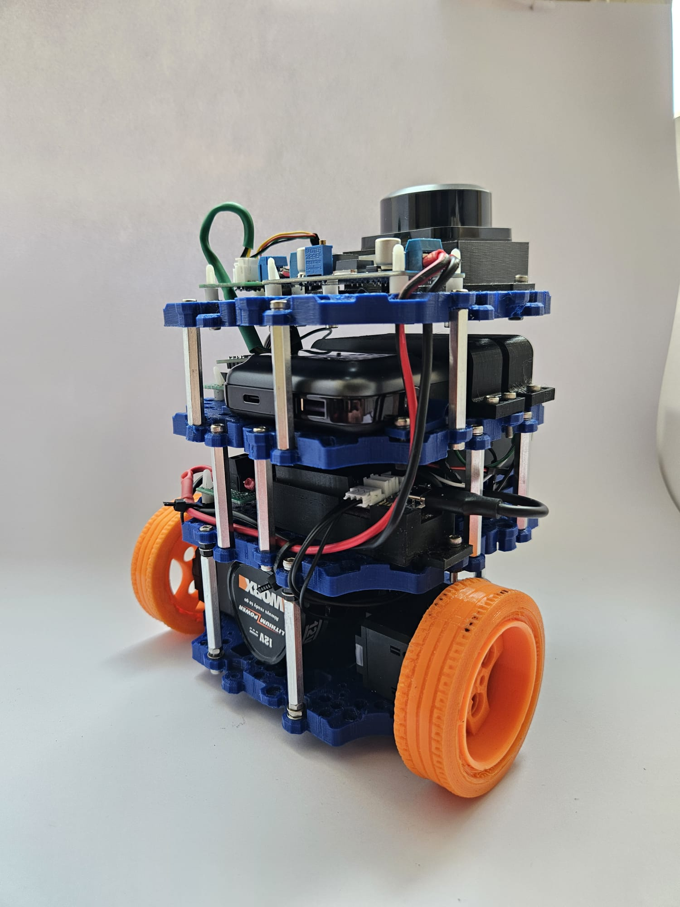

# AMR-BC: Robot móvil modular de bajo coste




## Descripción

Este repositorio recoge el desarrollo software y parte de la documentación técnica del robot móvil **AMR-BC**, una plataforma robótica modular de bajo coste desarrollada como Trabajo Fin de Grado en Ingeniería Electrónica Industrial y Automática.

El proyecto integra diseño mecánico mediante impresión 3D, electrónica de control, sensorización, comunicación hardware-software y validación funcional mediante ROS 2.

La plataforma está basada en una **Raspberry Pi 5**, un controlador **OpenRB-150**, motores **DYNAMIXEL XL430**, un sensor **RPLIDAR C1**, una IMU **BNO055** y una arquitectura de alimentación separada para potencia y computación.

## Características principales

- Robot móvil de bajo coste con arquitectura modular.
- Chasis y soportes diseñados mediante CAD e impresión 3D.
- Control de motores DYNAMIXEL XL430 mediante bus TTL.
- Comunicación entre Raspberry Pi 5 y OpenRB-150.
- Integración del LiDAR RPLIDAR C1 mediante UART.
- Lectura de la IMU BNO055 mediante I2C.
- Visualización de datos LiDAR en ROS 2 y RViz2.
- Pruebas de teleoperación y validación percepción-actuación.
- Separación entre alimentación de potencia y alimentación de computación.

## Arquitectura del sistema

El robot se estructura en los siguientes subsistemas:

| Subsistema | Elementos principales |
|---|---|
| Computación | Raspberry Pi 5 |
| Control de actuadores | OpenRB-150 |
| Actuación | Motores DYNAMIXEL XL430 |
| Percepción | RPLIDAR C1 e IMU BNO055 |
| Alimentación | Batería de 12 V y power bank USB-C PD |
| Software | Debian, Docker, ROS 2 Humble, Python y RViz2 |

## Demostraciones

A continuación se muestran algunas pruebas realizadas durante la validación del robot móvil AMR-BC.

### Teleoperación del robot

Prueba de control manual del robot mediante teclado, verificando el movimiento de los motores DYNAMIXEL y la respuesta del sistema en tiempo real.

[Ver vídeo en YouTube](https://www.youtube.com/shorts/N6F5oDQjqJE)

### Lectura de la IMU BNO055

Validación de la comunicación I2C entre la Raspberry Pi 5 y la IMU BNO055, obteniendo datos de orientación, aceleración, giroscopio y magnetómetro.

[Ver vídeo en YouTube](https://www.youtube.com/shorts/N6F5oDQjqJE?feature=share)

### Validación del LiDAR en RViz2

Prueba de adquisición de datos del sensor RPLIDAR C1 mediante ROS 2 y visualización del escaneo 2D en RViz2.

[Ver vídeo en YouTube](https://www.youtube.com/watch?v=fPHqbw8lGJI)

### Teleoperación y escaneo LiDAR en tiempo real

Prueba conjunta donde el robot se controla por teleoperación mientras el LiDAR actualiza en tiempo real la representación del entorno en RViz2.

[Ver vídeo en YouTube](https://www.youtube.com/shorts/moTShs6l5g4?feature=share)

## Estructura del repositorio

```text
.
├── docs/              # Esquemas, imágenes y documentación auxiliar
├── src/               # Código fuente del robot
├── ros2/              # Configuración ROS 2, launch y RViz
├── cad/               # Archivos CAD y piezas imprimibles
├── images/            # Imágenes utilizadas en el README
├── videos/            # Enlaces a vídeos de validación
├── README.md
└── LICENSE
```


